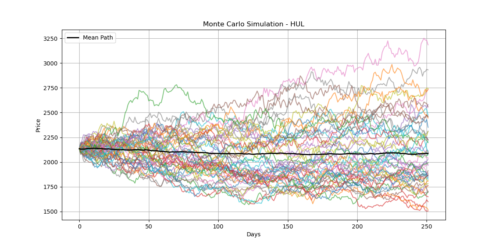
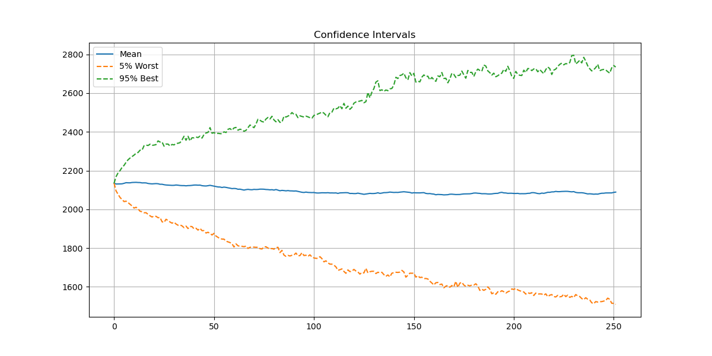
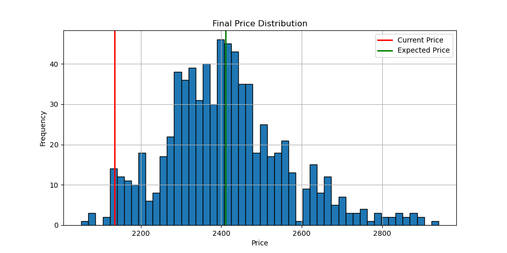

# 📊 Monte Carlo Risk Analysis – Hindustan Unilever (HUL)

## 📌 Overview

This project applies Monte Carlo Simulation to forecast future stock prices of Hindustan Unilever and evaluate financial risk using historical data.

---

## 🧠 Key Concepts

* Monte Carlo Simulation
* Geometric Brownian Motion
* Log Returns
* Volatility & Drift
* Value at Risk (VaR)

---

## 📊 Visual Results

### 🔹 Monte Carlo Simulation Paths



---

### 🔹 Confidence Interval (Prediction Bands)



---

### 🔹 Final Price Distribution (Risk Analysis)



---

## 📈 Results Summary

| Metric              | Value   |
| ------------------- | ------- |
| Initial Price       | 2134.80 |
| Expected Price      | 2088.95 |
| Expected Return     | -2.15%  |
| Probability of Loss | 58.33%  |
| VaR (95%)           | 1509.33 |

---

## 🔍 Key Insights

* Expected return is negative → bearish outlook
* Probability of loss > 50% → higher downside risk
* VaR shows significant potential loss in worst-case scenarios
* Wide distribution indicates uncertainty and volatility

---

## 🎯 Business Interpretation

The simulation suggests that Hindustan Unilever carries moderate-to-high downside risk under current conditions.
While upside potential exists, the likelihood of losses is higher, making it a risk-sensitive investment in the short term.

---

## ▶️ How to Run

```bash
pip install -r requirements.txt
python main.py
```

---

## 📁 Project Structure

```
Monte-Carlo-HUL-Analysis/
│
├── images/
├── main.py
├── requirements.txt
└── README.md
```

---

## 🚀 Future Improvements

* Multi-stock comparison
* Portfolio optimization
* Streamlit dashboard
* Real vs predicted comparison

---

## 👨‍💻 Author

**Mohd Fazal Hussain**
Aspiring Data Analyst / Data Scientist
